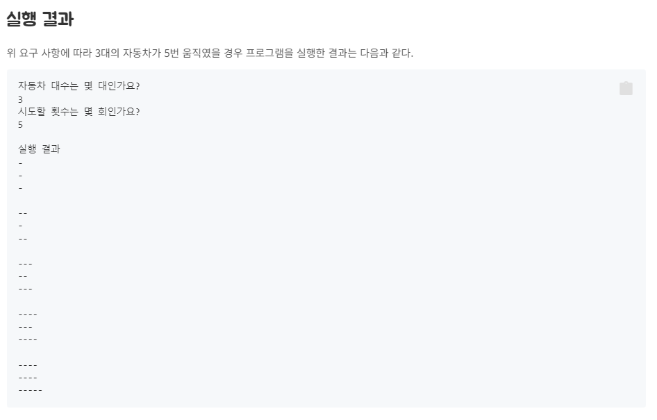
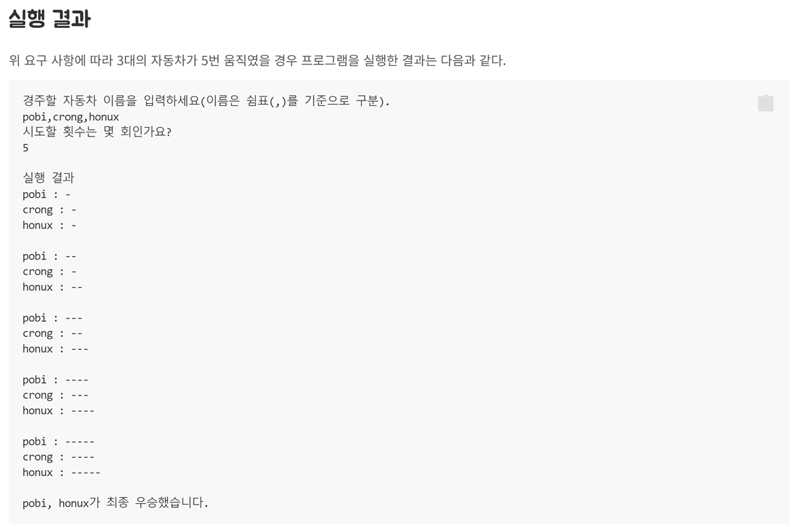
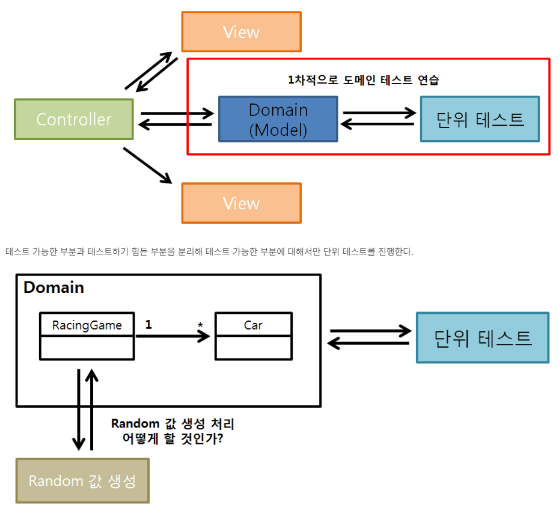

# Step2(koltin-calculator)
## 요구사항
"2 + 3 * 4 / 2"와 같은 문자열을 입력할 경우 2 + 3 * 4 / 2 실행 결과인 10을 출력해야 한다.

아래의 기능항목에 대한 테스트코드를 작성한다.
* 덧셈
* 뺄셈
* 곱셈
* 나눗셈
* 입력값이 null이거나 빈 공백 문자일 경우 IllegalArgumentException throw
* 사칙연산 기호가 아닌 경우 IllegalArgumentException throw
* 사칙 연산을 모두 포함하는 기능 구현

## 요구사항 세분화
요구사항을 정리하면, 문자열로 수식을 입력하면 이를 연산자 기준으로 순차적으로 계산하여 결과를 반환하는 것을 목표로 한다.
이는 입력값에 대한 숫자,연산자의 분류하고 입력값(숫자, 연산자)에 대한 검증, 연산으로 정리할 수 있다.

* 입력값 분류, 연산 및 검증
    * 분류
        * 입력 받는 문자열에서 숫자와 연산자를 분류해야 한다.
    * 검증
        * 입력받는 연산자 기호가 '+, -, *, /' 가 아닌 경우 에러를 반환해야 한다.
        * 입력받는 값이 NULL OR EMPTY인 경우 에러를 반환해야 한다.
        * 입력받는 값에 연산자 기호 이외에 숫자가 아닌 값이 있으면 에러를 반환해야 한다.
    * 연산
        * 연산은 입력받은 문자열 연산자를 순차적으로 처리해야 한다.
        * 연산 종류
            * 덧셈
            * 뺄셈
            * 곱셈
            * 나눗셈
            * 일치하지 않는 연산자가 없을 경우 에러를 반환한다.

## 요구사항의 책임을 나누자
* 입력, 수식, 연산으로 분류할 수 있을 것 같다.
    * 입력
        * scanf를 사용하여 입력값을 받는다.
        * 입력값이 null이거나 빈공백인지 검증한다.
        * 입력값된 문자열의 불필요한 공백을 제거한다.
    * 수식
        * 수식에는 연산자와 숫자를 다룬다.
            * 연산자와 숫자의 묶음을 별도의 일급콜랙션으로 정의할지를 고민해야 한다.
                * 현재 요구사항에서는 연산자나 숫자 자신에 대한 별도의 비지니스로직이 없다고 생각해서 일급콜랙션으로의 도출은 과하다고 판단한다.
        * 수식을 입력 받아 연산한 결과를 반환한다.
            * 입력된 수식이 올바르지 않은 경우 에러를 반환한다.
                * 경우1: 사칙연산자를 제외한 값을 추출했을때 숫자가 아닌 경우.
                * 경우2: 연산될 숫자값이 없는 경우.
                * 경우3: 연산될 연산자가 없는 경우.
    * 연산
        * 연산은 사칙연산을 다룬다.
        * enum을 활용하면 각각의 사칙연산자의 행위를 정의하여 사용할 수 있다.
        * 입력받는 두개의 숫자와 한개의 연산자가 필요하다.
        * 일치하지 않는 연산자를 주입받았을 경우 에러를 반환한다.

# Step3(kotlin-racingcar)
## 요구사항
초간단 자동차 경주 게임을 구현한다.

* 주어진 횟수 동안 n대의 자동차는 전진 또는 멈출 수 있다.
* 사용자는 몇 대의 자동차로 몇 번의 이동을 할 것인지를 입력할 수 있어야 한다.
* 전진하는 조건은 0에서 9 사이에서 무작위 값을 구한 후 무작위 값이 4 이상일 경우이다.
* 자동차의 상태를 화면에 출력한다. 어느 시점에 출력할 것인지에 대한 제약은 없다.

## 요구사항을 책임단위로 세분화
요구사항을 정리해서 한문장으로 풀면 다음과 같다
* 사용자가 차량수, 실행횟수를 입력하면 생성된 차량별로 각각 0~9 랜덤수 중 하나를 추출하여 4이상이면 1회 실행당 1거리 전진을 한다.
* 자동차와 이동거리, 자동차 집합, 라운드, 이동여부 정도가 도출될 것 같다.
* 이번에는 원시값으로 사용될만한 변수들이 각각 생성시 검증 책임을 가지도록 원시값 포장을 하도록 하자.
* 차량들의 집합체인 자동차들은 자동차에 대한 일급 콜랙션으로 구현한다.
  * 일급콜랙션으로서의 책임영역은 자동차들의 주행, 그리고 주행결과를 다룬다.
  * 각 자동차별로 이동여부를 판별해야 하며, 이를 테스트할 수 있는 구조로 작성하기 위해서는 판별하는 과정의 결과값을 이동메소드에 주입받는 식으로 구성해야 할 것 같다.
    * 이러한 방식으로 구현할 경우, 테스트영역에서 임의 값을 가지고 테스트하지 않고 설정값을 직접 정할 수 있는 Double을 생성하여 의도된 값을 주입하고 이에따른 주행결과를 확인할 수 있다.

* 이동거리
    * 시작값이 0이여야 한다.
    * 이동명령이 오면 증가값 만큼 이동거리가 변경되어야 한다.
        * 여기서 증가 값은 요구사항기준인 1로 정의한다.
* 자동차
  * 최초 생성시 이동거리가 0인 상태로 생성되어야 한다.
  * 자동차가 이동하는 행위를 다룬다.
    * 이동여부가 참이면 거리객체에 전진메세지를 전달하여 이동거리를 증가시킨다.
* 이동거리 판단 전략패턴
  * 0~9 랜덤 양의 정수중 하나를 선택하여 4이상인지 참/거짓을 반환한다.
* 자동차들
  * 경기에 투입되는 자동차들의 모임 -> 일급 콜랙션
  * 생성되는 차량의 수를 다룬다.
  * 입력되는 차량 생성 수에 대한 검증을 다룬다.
    * null or empty 여부
    * 0을 초과하는지 여부
    * 정수형인지 여부
  * 각 차량들에게 이동을 시도하게 한다.
* 라운드
  * 레이싱의 실행횟수를 다룬다.
  * 입력되는 레이싱 카운트에 대한 검증을 다룬다.
    * null or empty 여부
    * 0을 초과하는지 여부
    * 정수형인지 여부
* 레이싱
  * 자동차 경주에 대한 게임 생성 및 실행을 다룬다.
  * 입력 받은 차량수, 라운드 수로 게임을 생성한다.
  * 생성된 게임을 라운드 수 만큼 실행하여 결과를 노출한다.

# Step4(kotlin-racingcar-우승자)
## 요구사항
초간단 자동차 경주 게임을 구현한다.

* 각 자동차에 이름을 부여할 수 있다. 자동차 이름은 5자를 초과할 수 없다.
* 전진하는 자동차를 출력할 때 자동차 이름을 같이 출력한다.
* 자동차 이름은 쉼표(,)를 기준으로 구분한다.
* 자동차 경주 게임을 완료한 후 누가 우승했는지를 알려준다. 우승자는 한 명 이상일 수 있다.

## 요구사항을 책임단위로 세분화
기존에 요구되었던 일부분이 변경되고 추가되는 기능이 있다.
* 변경사항
  * 기존에 자동차 수를 입력받아서 차량을 생성함 -> 한줄의 문자열로 들어오는 차량의 이름을 쉼표로 구분하여 차량을 생상한다.
  * 문자열을 나누는 것에 대한 검증 조건을 고려해야 할 것 같다.
    * 앞뒤 문자열의 빈공백은 제거.
  
* 신규기능 추가    
  * 차량의 이름이 추가됨.
    * 글자수 4자리 이하.
    * 레이싱 경기를 출력시 차량의 이름이 나와야 한다.
  * 레이싱 종료 후 최종 승자를 탐색하는 최대값 비교 로직이 필요하다.
      * 1등의 중복이 허용된다.
      * 1등 차량의 이름을 쉼표 기준으로 나열에서 노출해야 한다.

* 자동차
  * 이름을 가진다.
* 자동차들
  * 가장 멀리 간 자동차를 알수 있어야 한다.
    * 가장 멀리간 자동차가 두대 이상일 수 있다.
* 이름
  * 5글자를 초과할 수 없다.
  * 특수문자등의 별다른 제약조건은 가지지 않는다.
  * 4글자중에 공백은 허용되나 빈아이디는 허용하지 않는다.
* 레이싱
  * 기존에 자동차 수를 입력했던 부분을 변경한다
    * 입력시 한줄의 문자열로 구분자 ','를 통해서 각각의 이름을 구분해야 함.
  * 우승자를 찾아야 한다.
    * 차량 별 거리값 중에 최대값을 구하는 로직이 필요하다.
    * 최대 이동거리와 같은 거리를 이동한 차량들을 탐색후 차량명을 반환하는 로직이 필요하다.
* 입출력 뷰
  * 레이싱 경기시, 이름을 같이 출력해야 한다.
  * 우승자를 ','를 구분으로 한줄의 문자열로 출력해야 한다.

Step5(kotlin-racingcar-리팩터링)
## 요구사항
* 핵심 비지니스 로직을 가지는 객체를 domain 패키지, UI 관련한 객체를 view 패키지에 구현한다.
* MVC 패턴 기반으로 리팩토링해 view 패키지의 객체가 domain 패키지 객체에 의존할 수 있지만, domain 패키지의 객체는 view 패키지 객체에 의존하지 않도록 구현한다.

## 그외 추가 요구사항
Racing class의 playRacing()를 테스트 케이스로 작성해보는 건 어떨까합니다. 이렇게 되면, view에 대한 영역도 분리가 되어야되겠죠?
조건은 아래와 같습니다.

* RacingGame에 참가한 자동차들의 거리는 모두 다르도록 한다.
* 우승자는 한명으로 지정한다.

## 추가요구사항 이슈
* 각 차량의 이동거리가 고유하기 위해서는 반드시 라운드수가 "차량수-1"인 값과 일치해야 경우의 수가 가능하다.(DM 드렸을때는 일치해야 한다고 말씀드렸는데요. 생각해보니 -1이 되어도 충족되네요.)
  * 차량 증가에 따른 각기 다른 이동거리 및 우승자가 당첨되는 시뮬레이션을 시트로 표현해보면 아래와 같음.

  * 입력시 차량의 수를 먼저 체크하고 이에 따라 라운드를 입력받을때 최소값을 가이드 해야 한다.-> 라운드 도메인 수정 필요.
  * 이동거리에 대한 경우의 수를 만들 방법을 찾아야 한다.
    * 우승자를 먼저 선정한다면?
      * 입력받은 차량 3대중 한대를 랜덤으로 우승자로 선정한다.
      * key:value 구조에서 car : listOf(true, false....)식으로 라운드별 이동여부를 콜랙션으로 생성한다.

## 요구사항을 책임단위로 세분화
* controller 패키지 생성 및 구현.
  * 컨트롤러에서 계약모델 view를 반환하는 구조로 이해하고 racing에서 경기 내용과 경기 결과를 각각 나눠 받아서 하나의 view로 완성해야 한다.
    * 해당 작업을 진행하면 자연스럽게 playRacing 에서 view 영역이 분리되면서 추가요청사항을 다룰 수 있을 것 같다.
* racing 클래스 개선.
  * playRacing 안에 다루고 있는 view 영역의 분리.
  * 기존 경기진행과 결과를 다루는 하나의 함수를 분리.
    * 경기 내용을 다루는 함수 생성.
      * 매라운드별 결과를 콜랙션으로 담아야 한다.(list<Cars> 같은 구조가 될 것으로 예상.)
      * 이 라운드별 레이싱상황을 담는 콜랙션은 별다른 비지니스가 없어서 일급 콜랙션화는 일단 보류한다.
    * 경기 결과를 다루는 함수 생성.
* MoveStrategy 추가
  * 우승자를 1명 지정하고 이에 따른 차등 판별이 되도록 구성해본다.
